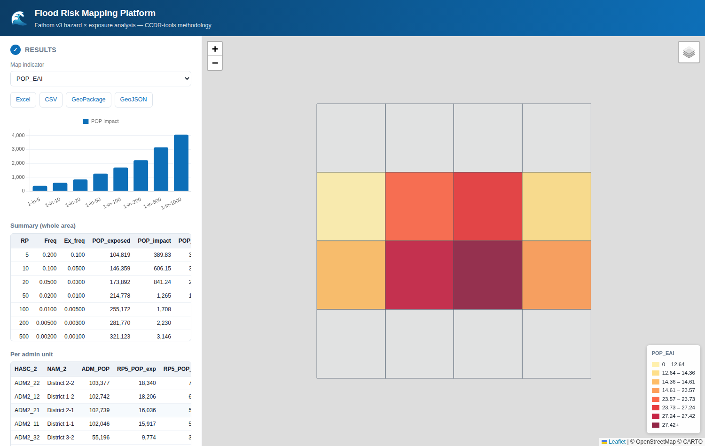
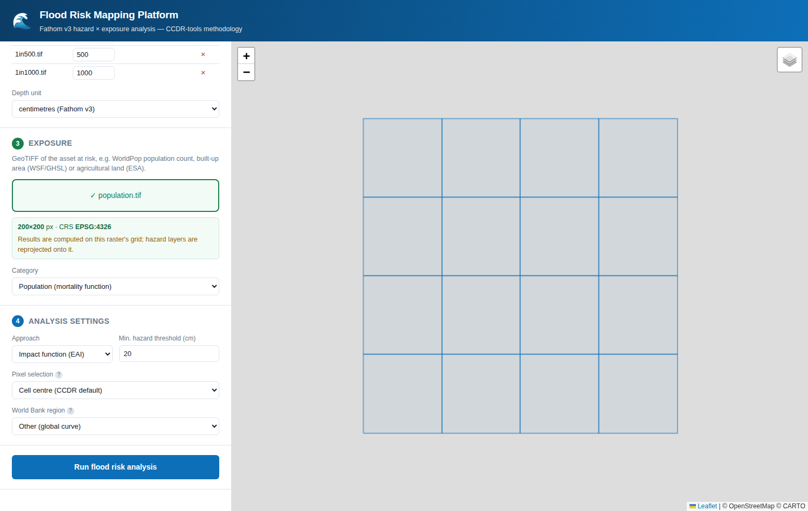

# Flood Risk Mapping Platform

A self-contained web application for probabilistic flood risk analysis, replicating the
flood (FL) workflow of the World Bank / GFDRR
[CCDR-tools](https://github.com/GFDRR/CCDR-tools) notebook.

Upload your **Fathom v3 flood depth rasters**, an **exposure raster** and your
**administrative boundaries**, choose the settings, and get Expected Annual Impact
(EAI) or Expected Annual Exposure (EAE) per administrative unit — as an interactive
map, charts, and downloadable tables.



<details>
<summary>Input steps</summary>



</details>

## Why this exists

The CCDR-tools flood analysis is a Jupyter notebook with a heavy geospatial stack
(dask, multiprocess, rioxarray, rasterstats) that expects a specific on-disk data
tree (`DATA/HZD/<ISO3>/<hazard>/<period>/<scenario>/1in<RP>.tif`) and downloads its
own boundaries and exposure layers. That makes it awkward to run against data you
already have. This platform keeps the **same methodology and the same equations**
but replaces the notebook with a browser UI where every input is simply uploaded.

## Quick start

Requires Python 3.9+ and nothing else — the dependencies ship as wheels, so no
system GDAL install is needed.

```bash
git clone https://github.com/thibaultbdb/Flood-Modeling
cd Flood-Modeling
git checkout claude/flood-risk-mapping-platform-l0ixtw
./quickstart.sh
```

That creates a virtualenv, installs the dependencies, generates a synthetic
sample dataset, and starts the server on <http://127.0.0.1:8000>. It takes about
a minute on a first run and is safe to re-run.

Then, in the browser, upload from `tests/sample_data/`:

| Step | File(s) |
|---|---|
| 1. Boundaries | `boundaries.zip` |
| 2. Hazard | `1in5.tif` … `1in1000.tif` (select all eight at once) |
| 3. Exposure | `population.tif` |

Press **Run flood risk analysis**. Results appear in a few seconds.

Already have the dependencies installed? `./run.sh` starts the server on its own.
To verify independently: `python3 tests/test_analysis.py` (analysis engine) and
`python3 tests/test_exposure_fetch.py` (exposure download, against a local
stand-in — no network needed).

If `data.worldpop.org` is blocked on your network, set `FRM_WORLDPOP_BASE` to a
mirror, or use the *Upload a raster* tab.

### Using your own data

Swap in your own files at the same three steps:

- **Hazard** — your Fathom v3 GeoTIFFs, one per return period, for a single
  hazard type / period / scenario. Depths are centimetres in Fathom v3, which is
  the default; switch the *Depth unit* selector if yours are in metres.
- **Boundaries** — your admin units, zipped with the `.shp`, `.dbf`, `.shx` and
  `.prj` together (the `.prj` matters — without it the CRS is unknown and the
  upload is rejected).
- **Exposure** — for population, just type the **ISO3 country code** (`NGA`,
  `BGD`, `MOZ`…) and the WorldPop 2020 UN-adjusted constrained 100 m raster is
  downloaded for you, exactly as CCDR-tools does it. For built-up or
  agricultural exposure, switch to the *Upload a raster* tab and supply your own
  — e.g. [GHSL](https://human-settlement.emergency.copernicus.eu) built-up
  surface or [ESA WorldCover](https://esa-worldcover.org) cropland.

Nothing needs to share a grid or CRS; hazard layers are warped onto the exposure
grid automatically, and the exposure raster sets the analysis resolution.

## Inputs

| Step | Input | Format | Notes |
|---|---|---|---|
| 1 | Administrative boundaries | zipped shapefile (`.zip` containing `.shp`/`.dbf`/`.shx`/`.prj`), GeoJSON or GeoPackage | Must carry a CRS. You then pick the *code* and *name* attribute fields (auto-guessed). |
| 2 | Flood hazard | one GeoTIFF per return period | Return periods are auto-detected from filenames (`1in100.tif`, `RP_100.tif`, `100yr.tif`) and editable in the table. |
| 3 | Exposure | ISO3 country code, or a GeoTIFF | Population downloads automatically from WorldPop by country code; built-up and agricultural exposure are uploaded. |

**Fathom v3 layout.** Fathom ships one file per return period per scenario, e.g.
`FLUVIAL_UNDEFENDED/2020/1in5.tif … 1in1000.tif`. Upload the set for the single
hazard type / period / scenario you want to analyse; run the tool again for each
other combination. Depths are in **centimetres** in Fathom v3 — that is the default;
switch the *Depth unit* selector to metres if your rasters are already converted.

Hazard rasters do **not** need to match the exposure grid or CRS: each is warped onto
the exposure grid on the fly (`WarpedVRT`, nearest-neighbour), exactly as CCDR-tools
does. The exposure raster's grid therefore defines the analysis resolution.

## Settings

- **Approach**
  - *Impact function (EAI)* — converts depth to an impact fraction via a
    vulnerability curve, giving impacted exposure and Expected Annual Impact.
  - *Hazard classes (EAE)* — bins depth into user-defined classes and reports
    exposure per class and Expected Annual Exposure. Classes are **cumulative**:
    C1 counts everything at or above edge 1, so C0 ≥ C1 ≥ C2 ≥ …
- **Minimum hazard threshold** (default 20 cm) — depths at or below this are treated
  as no hazard, the CCDR-tools default.
- **World Bank region** — selects the regional damage curve for built-up and
  agriculture. Population mortality uses a single global curve, so this is hidden
  for population.
- **Pixel selection** — how raster cells are assigned to admin units:
  - *CCDR-compatible* (default) — reproduces CCDR-tools exactly: every touched
    pixel for the admin-unit totals, cell-centre for the per-return-period
    statistics. Note the consequence: boundary pixels are counted in **every**
    unit they touch, so the totals — and therefore the `EAI%`/`EAE%`
    denominators — are inflated where units are small relative to the pixel. In
    testing, 2,025 units over a 100 m grid inflated the total by 2.0%.
  - *Exact partition (cell centre)* — cell-centre throughout, so every pixel is
    counted exactly once and the totals sum to the true raster total. Choose this
    if you care about the percentage indicators.
  - *All touched* — every touched pixel throughout; maximises coverage when units
    are smaller than a few pixels, at the cost of double-counting boundaries.

  The absolute EAI/EAE and per-return-period impacts are **identical** under
  *CCDR-compatible* and *Exact partition* — only the totals and the percentage
  indicators differ.

## Methodology

Ported from `tools/code/runAnalysis.py` and `tools/code/damageFunctions.py`.

**1. Impact per return period.** For each return period *i*, hazard depth is warped
onto the exposure grid and thresholded. Under the function approach the depth *d*
becomes an impact factor *F(d) ∈ [0,1]*, and per admin unit:

```
exposed_i  = Σ  exposure(px)              over pixels where F(d) > 0
impact_i   = Σ  exposure(px) · F(d(px))   over the same pixels
```

**2. Exceedance frequency.** With return periods RP₁ < RP₂ < … < RPₙ and
probabilities *pᵢ = 1/RPᵢ*, CCDR-tools assigns each return period a frequency
weight, computed three ways:

```
LB_i    = p_i − p_{i+1}          (last: p_n)
UB_i    = p_{i−1} − p_i          (first: 0)
Mean_i  = (LB_i + UB_i) / 2
```

**3. Expected Annual Impact.** The impact–frequency curve is integrated:

```
EAI  = Σ_i  impact_i · freq_i
EAI% = EAI / total exposure × 100
```

The **Mean** estimate is reported as `POP_EAI` / `BU_EAI` / `AGR_EAI`; the lower and
upper bounds are kept alongside as `*_EAI_LB` and `*_EAI_UB` so you can see the
integration uncertainty. The class approach substitutes exposure per class for
impact and produces `*_C<n>_EAE` in the same way.

With a **single** return period the calculation is deterministic — per-return-period
results only, no EAI — matching CCDR-tools.

### Vulnerability curves

Reproduced verbatim from CCDR-tools (`damageFunctions.py`); depth *x* in metres:

| Exposure | Curve | Source |
|---|---|---|
| Population (`POP`) | `0.985 / (1 + e^(6.32 − 1.412x))` | Jonkman (2008), [doi:10.1111/j.1753-318X.2008.00006.x](https://doi.org/10.1111/j.1753-318X.2008.00006.x) |
| Built-up (`BU`) | regional sigmoid (Africa / Asia / LAC / Global) | Huizinga et al. (2017), EU-JRC |
| Agriculture (`AGR`) | regional sigmoid (Africa / Asia / LAC / Global) | Huizinga et al. (2017), EU-JRC |

## Performance

Measured on 4 cores / 15 GB RAM, with 8 return periods of Fathom-like 30 m hazard
(12,000 × 12,000 px each) against a 100 m exposure raster (4,000 × 4,000 px):

| Admin units | Analysis | End-to-end in browser | Peak memory |
|---|---|---|---|
| 2,025 | 36 s | 40 s | 0.9 GB |
| 10,000 | 104 s | 129 s | 0.9 GB |

Memory is flat in the number of units because the exposure raster is windowed to
the boundary extent and each return period is processed and released in turn;
runtime grows roughly linearly with units × return periods. Boundaries are capped
at 20,000 features — beyond roughly 10,000 the browser map, not the analysis,
becomes the slow part.

## Outputs

Per administrative unit: total exposure, exposed and impacted exposure for every
return period, and EAI/EAE with LB/UB bounds and percentages.

- **Excel** — `Results`, `Summary` (whole-area totals per return period) and
  `Exceedance_freq` sheets
- **CSV** — the results table
- **GeoPackage** / **GeoJSON** — the same table with geometry, ready for QGIS

In the browser you also get a quantile-classed choropleth (switchable between every
output indicator), per-unit popups, the impact-vs-return-period chart, and sortable
tables.

## Differences from the CCDR-tools notebook

Deliberate, and worth knowing:

0. **The notebook's agriculture download is not reproduced, because it is
   wrong.** `fetch_agri_data()` in `input_utils.py` requests the *population*
   dataset and saves it as `{country}_AGR.tif`, so the notebook's "agriculture"
   exposure is mislabelled population data. Upload a real cropland raster
   instead.

1. **Boundaries are always supplied by you.** The notebook downloads them
   (GADM/WB) by ISO3 country code; here you upload them, so the tool works for any
   area of interest, including non-country study areas and custom boundaries.
   Population exposure *is* downloaded by country code as in the notebook;
   built-up and agricultural exposure are uploaded rather than fetched (the
   notebook pulls built-up from a WSF STAC search, which is not reproduced).
2. **Flood only.** Tropical cyclones, the custom-hazard and bivariate workflows, and
   the climate-scenario folder conventions are not included, as requested.
3. **Zonal statistics** are computed per feature with an explicit rasterised mask
   rather than through `rasterstats`. Results are equivalent, and this handles
   multipart geometries (islands, enclaves) directly — so the notebook's
   explode-and-reaggregate workaround for nested multiparts is unnecessary.
4. **Single-process.** No dask/multiprocess. The exposure raster is windowed to the
   boundary extent, which keeps typical national runs comfortable in memory, but a
   very large area at 30 m will be slower than the parallel notebook.
5. **Pixel selection is exposed as a setting.** CCDR-tools is internally
   inconsistent here — `all_touched=True` for admin totals but rasterstats'
   default `False` for the per-return-period statistics — which inflates the
   totals used as the `EAI%` denominator. The default reproduces that behaviour
   exactly for comparability; *Exact partition* corrects it.

## Project layout

```
app/
  main.py              FastAPI backend: uploads, jobs, downloads
  analysis.py          analysis engine (the CCDR-tools port)
  damage_functions.py  vulnerability curves, ported verbatim
  static/              UI (vanilla JS + Leaflet + Chart.js, all vendored)
tests/
  test_analysis.py     engine test suite
  make_sample_data.py  synthetic Fathom-like dataset generator
run.sh                 launcher
```

The frontend dependencies (Leaflet 1.9.4, Chart.js 4.4.4) are **vendored** under
`app/static/vendor/`, so the application runs with no internet access — which
matters when handling licensed Fathom data on a closed network. Only the basemap
tiles need connectivity; the map has a *None (offline)* basemap option, and analysis
never requires network access.

## Notes and limits

- Results are stored per session under `data/` and are not authenticated. This is
  built as a **local / trusted-network analysis tool**; don't expose it to the open
  internet without adding authentication and upload limits.
- The upload path holds the whole exposure raster window in memory. For very large
  rasters, clip to your area of interest first.
- Boundaries are capped at 20,000 features. See **Performance** above.

## Licence and attribution

The methodology and the vulnerability curves come from
[GFDRR/CCDR-tools](https://github.com/GFDRR/CCDR-tools) (World Bank / GFDRR).
Fathom v3 flood data is licensed separately — this tool never transmits your data
anywhere; all processing happens on the machine running the server.
